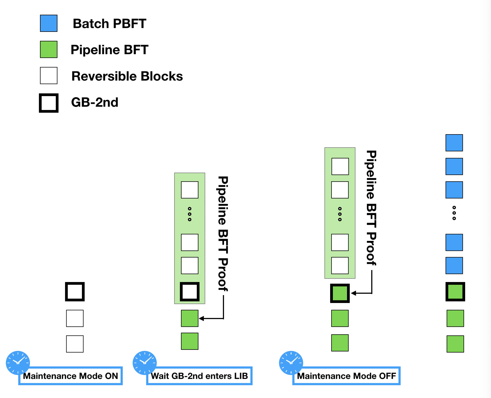

# PART II  BOS Batch-PBFT Upgrade Solution
## 1. System Upgrade is Fundamental
Change is the nature of software. The only thing that keeps unchanged, in software engineering, is change. In modern software engineering, maintainability makes sure that we are not suffering too much when making changes. For example, programming languages are evolving, new language features are added and deprecated features are removed. Software products follow the rule of agile development and lean startup to evolve. Blockchain technology is no exception. For example, Bitcoin doesn't have a smart contract, then Ethereum supports immutable smart contracts, and now EOS supports upgradable smart contracts. Upgradable smart contracts make a big step towards upgradable DApp services.

the compatibility issue is a real-world problem when new features are introduced or when existing features are upgraded. For example:
- In console games, PS4 is not compatible with PS3 games.
- In the programming language, python 3 is not compatible with python 2.
- In iPhone hardware, iPhone XR doesn't support 3D force touch.

It is not uncommon to break the compatibility when necessary.

EOS, Enterprise Operating System, is designed to behave like an operating system. It should be able to upgrade as frequently as possible, and an indirect proof is that EOSIO version has been upgraded from 1.0 to 1.6 in past 6 months. Since blockchain technology is a new category of software, therefore, it should follow the general rule of software and have special features. In traditional software/operation system, there is no hard fork problem because they are isolated and work alone. The hard fork is a special compatibility issue introduced in the blockchain.

We can categories the severity of system upgrade into different compatibility levels:
1. **backward compatible**  
Most upgrades fall into this category, for example, virtual machine upgrade to WABT, signature validation optimization.
2. **soft fork**  
In most cases, it is related to the system contract.
3. **hard fork**  
Usually, this happens when a very fundamental behavior changes and it does not act backward compatible. For example, Rex upgrade, DPOS-Batch-PBFT consensus protocol upgrade.

## 2. System Upgrade Solution
We will discuss the possible solution to upgrade the consensus protocol,`from Pipeline BFT to Batch PBFT`, in BOS. We also want to discuss a general approach to make system upgrade process smoother.

### Terms:

**GB-2nd** - Second Genesis Block  
Genesis block is the first block of blockchain and provides the source of trust. As time goes, Merkle tree and node network work together to provide the trust of the blockchain. GB-2nd is the second genesis block, for example in block #1,000,000, to re-build the source of trust point. it is critical to the trust chain especially when consensus rule has changed. A similar approach could take place during 3rd, 4th and x-th system upgrade.

**Maintenance Mode**:  
It has a boolean value ON/OFF to indicate the maintenance status of system contract. If the value is on, system contract is in maintenance mode and BP schedule is frozen; If the value is off, system contract is functioning normally.

### Possible Solution:  

The brief idea is that all nodes and BPs switch to use Batch PBFT when GB-2nd enters LIB. In order to ensure the liveness, only function related to the BP schedule update is frozen temporarily.

**PREPARE PHASES:**

**prepare phase 0**: off-chain agreement on upgrade solution

**prepare phase 1**: decide GB-2nd block number, for example block #1,000,000

**prepare phase 2**: all related BPs and full nodes upgrade to new version node and system contract

**prepare phase 3**: use multi-sig to set GB-2nd block number

**EXECUTION PHASES:**

`This phase is an automated upgrading process. All functions work normally except BP schedule is frozen for near 3 minutes.`

**phase 0**: when head block number is less than GB-2nd, Pipeline BFT is chosen.

**phase 1**: wait until GB-2nd is produced. Maintenance mode should be switched to ON automatically. Thereafter BP schedule is frozen until upgrade finished.

**phase 2**: wait until GB-2nd enters LIB. Then all BPs and nodes switch to use Batch PBFT. Meanwhile, switch maintenance mode to OFF and unfreeze BP schedule. The upgrade is finished.

When GB-2nd enters LIB, there are 300+ blocks between HEAD and LIB. These blocks hold proof that GB-2nd is valid under the previous consensus algorithm. Therefore, GB-2nd becomes a trusted source. After the switch, BPs start the process of Batch PBFT based on GB-2nd, 300+ blocks mentioned above will go through prepare and commit phases and be kept in chain.

## 3. Conclusions
We have discussed why system upgrade is fundamental to software and blockchain. We also discussed a possible solution to upgrade consensus protocol `from Pipeline BFT to Batch PBFT`.

Consensus protocol upgrade is not the only one need such a solution. Another topic about REX upgrade has also been discussed broadly in the community. If you have any solution or improvements, welcome to share and discuss.  